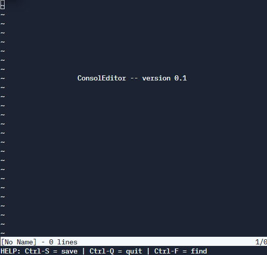

# consoleditor
> Under Development 🚧👷‍♂️ !

## A Text/File editor which works in terminal

* This editor works by changing the input mode of the terminal instance which it is running on !
* It takes raw input into the terminal/shell instead of the standard cooked mode  

## What it looks like 👀

## About the project

* Implementation Aim : C and System Call Implementation
* Goal : Implementing project from scratch + adding various functionalities to base code
* Inspiration and credits : https://github.com/antirez/kilo 

## How to use ?

* Just download the file and run the program 
* If no file is referenced a blank file will be available for writing
* Use (ctrl + s) to save the file
* Use (ctrl + q) to quit the editor
* Use (ctrl + f) to search for words/string in the file
